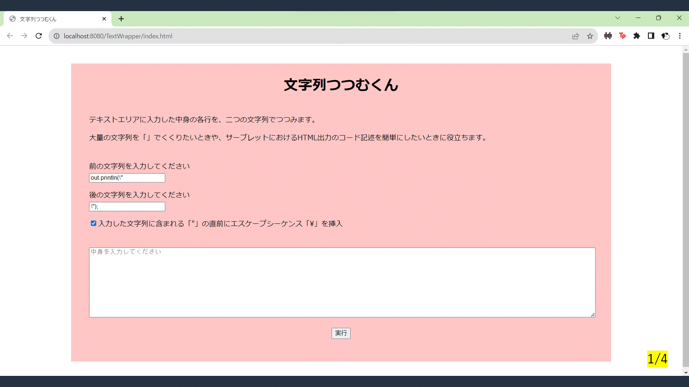
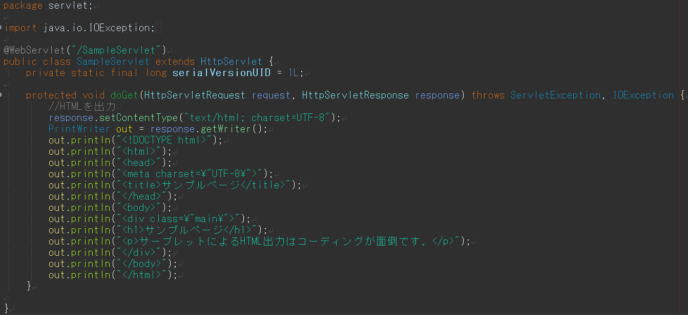

# TextWrapper(文字列つつむくん)

## 本システムについて

### 実行イメージ

### 概要

2 つのテキストボックスに入力した文字列で、テキストエリアに入力した文字列の各行をサンドして出力するシステムです。

結果画面の「結果をコピー」ボタンから、結果をクリップボードにコピーできます。

Java サーブレットユーザー向けの機能として、ダブルクォーテーション「"」の直前にエスケープシーケンス「\」を挿入することができます。

## 開発環境

- OS: Windows11
- IDE: Eclipse 2022
- サーバー: Apache Tomcat9

## 使用方法

残念ながら本システムはユーザーに利用いただける域まで達しておりません。  
ソースコードの公開とコンセプトのアウトプットを主な目的として、私個人のポートフォリオ的に Github 上に公開している現状です。

PaaS や IaaS を利用した実行環境を整備し、今年度中にデプロイすることを目標に学習を進めています。

## 使用言語

- Java(学習歴：9 ヶ月)
  - サーブレット・JSP(学習歴：2 ヶ月)
- HTML(学習歴：8 ヶ月)
- CSS(学習歴：8 ヶ月)
- JavaScript(学習歴：1 ヶ月)

## 作成のきっかけ

- 「Java サーブレットにおける HTML 出力のコーディングが面倒」という課題を解決するため、自分用にコードを書いたのがきっかけです。

- せっかくなので所属する学校のクラスメイトにも使ってもらいたいと考え、Web アプリケーション化しようと思い立ちました。

## 工夫した点・こだわり

- 当初はサーブレットコーディング専用のシステムだったが、エスケープシーケンス挿入の選択や、サンドする文字列を任意に入力できるようにして、汎用的に利用できるようにした点

- 結果画面の「結果をコピー」ボタンにより、使用感の向上を図った点

## 今後のビジョン

- チーム開発を意識したコーディング

  - Github の利用が初めてだったこともあり、手元でプロダクトをアップするだけになってしまった。
  - いつでも開発を分担、引き継ぎできるようなコーディングや Git 管理を実践していきたい。

- アプリケーションとしての実装
  - 所属する学校のアカウントで Azure を利用できるので、PaaS や IaaS を活用してユーザーの手の届くところまで実装したい(今年度中)
  - Linux や Docker といったインフラ周りの技術の習得を目指し、Github を実践的に用いたチーム開発ができるようになりたい(今年度中)
